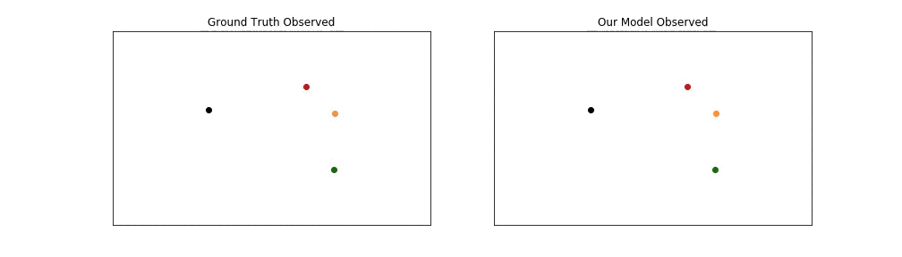

# Social GAN (CVPR 2018)

**<a href="https://arxiv.org/abs/1803.10892">Social GAN: Socially Acceptable Trajectories with Generative Adversarial Networks</a>**
<br>
<a href="http://web.stanford.edu/~agrim/">Agrim Gupta</a>,
<a href="http://cs.stanford.edu/people/jcjohns/">Justin Johnson</a>,
<a href="http://vision.stanford.edu/feifeili/">Fei-Fei Li</a>,
<a href="http://cvgl.stanford.edu/silvio/">Silvio Savarese</a>,
<a href="http://web.stanford.edu/~alahi/">Alexandre Alahi</a>
<br>

Human motion is interpersonal, multimodal and follows social conventions. In this paper, we tackle this problem by combining tools from sequence prediction and generative adversarial networks: a recurrent sequence-to-sequence model observes motion histories and predicts future behavior, using a novel pooling mechanism to aggregate information across people. Below we show an examples of socially acceptable predictions made by our model in complex scenarios. Each person is denoted by a different color. We denote observed trajectory by dots and predicted trajectory by stars.
<div align='center'>
</img>
</img>
</div>

## Model
Our model consists of three key components: Generator (G), Pooling Module (PM) and Discriminator (D). G is based on encoder-decoder framework where we link the hidden states of encoder and decoder via PM. G takes as input trajectories of all people involved in a scene and outputs corresponding predicted trajectories. D inputs the entire sequence comprising both input trajectory and future prediction and classifies them as “real/fake”.

<div align='center'>
  
</div>

## Setup
All code was developed and tested on Ubuntu 16.04 with Python 3.5 and PyTorch 0.4.

You can setup a virtual environment to run the code like this:

```bash
python3 -m venv env               # Create a virtual environment
source env/bin/activate           # Activate virtual environment
pip install -r requirements.txt   # Install dependencies
echo $PWD > env/lib/python3.5/site-packages/sgan.pth  # Add current directory to python path
# Work for a while ...
deactivate  # Exit virtual environment
```

## Model Training

You can use the script `scripts/run_traj.sh` to start training for different object categories with different input/output frames. For example, if you want to train Car trajectory forecasting model in 2-second prediction setting, you should modify dataset_name to 'aiodrive_Car' and skip to 2 in `scripts/run_traj.sh`, and then run the following command:
```
$ ./scripts/run_traj.sh
```
Simiarly, if you want to train Pedestrian trajectory forecasting model in 5-second prediction setting, you should modify dataset_name to 'aiodrive_Ped' and skip to 5 in `scripts/run_traj.sh`, and then run the same command above.

## Model Inference
You can use the script `scripts/evaluate_model.py` to easily run any of the trained models. If you model is saved to `path_to_your_model`, you can then run the following command:
```
python3 scripts/evaluate_model.py --model_path path_to_your_model
```

## AIODrive Evaluation
Once you have used your trained models to make predictions on all four object categories in 2-second prediction setting (and/or 1-second, 5-second settings), you can use the following script to merge results and submit to <a href="http://www.aiodrive.org/forecasting.html">AIODrive Trajectory Forecasting Challenge</a>.
```
python3 scripts/merge_AIODrive_results.py
```
