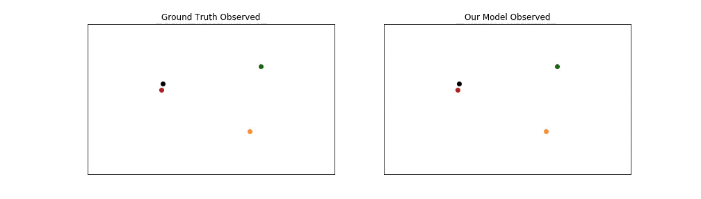

# Social GAN (CVPR 2018)

**<a href="https://arxiv.org/abs/1803.10892">Social GAN: Socially Acceptable Trajectories with Generative Adversarial Networks</a>**
<br>
<a href="http://web.stanford.edu/~agrim/">Agrim Gupta</a>,
<a href="http://cs.stanford.edu/people/jcjohns/">Justin Johnson</a>,
<a href="http://vision.stanford.edu/feifeili/">Fei-Fei Li</a>,
<a href="http://cvgl.stanford.edu/silvio/">Silvio Savarese</a>,
<a href="http://web.stanford.edu/~alahi/">Alexandre Alahi</a>
<br>

Human motion is interpersonal, multimodal and follows social conventions. In this paper, we tackle this problem by combining tools from sequence prediction and generative adversarial networks: a recurrent sequence-to-sequence model observes motion histories and predicts future behavior, using a novel pooling mechanism to aggregate information across people. Below we show an examples of socially acceptable predictions made by our model in complex scenarios. Each person is denoted by a different color. We denote observed trajectory by dots and predicted trajectory by stars.
<div align='center'>
</img>
</img>
</div>

## Model
Our model consists of three key components: Generator (G), Pooling Module (PM) and Discriminator (D). G is based on encoder-decoder framework where we link the hidden states of encoder and decoder via PM. G takes as input trajectories of all people involved in a scene and outputs corresponding predicted trajectories. D inputs the entire sequence comprising both input trajectory and future prediction and classifies them as “real/fake”.

<div align='center'>
  
</div>

## Setup
All code was developed and tested on Ubuntu 16.04 with Python 3.5 and PyTorch 0.4.

You can setup a virtual environment to run the code like this:

```bash
python3 -m venv env               # Create a virtual environment
source env/bin/activate           # Activate virtual environment
pip install -r requirements.txt   # Install dependencies
echo $PWD > env/lib/python3.5/site-packages/sgan.pth  # Add current directory to python path
# Work for a while ...
deactivate  # Exit virtual environment
```

## Model Training
Instructions for training new models can be [found here](TRAINING.md).

## Models Inference
You can use the script `scripts/evaluate_model.py` to easily run any of the pretrained models on any of the datsets. For example you can replicate the Table 1 results for all datasets for SGAN-20V-20 like this:

```bash
python scripts/evaluate_model.py \
  --model_path models/sgan-models
```

